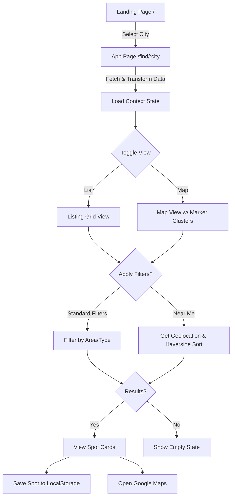
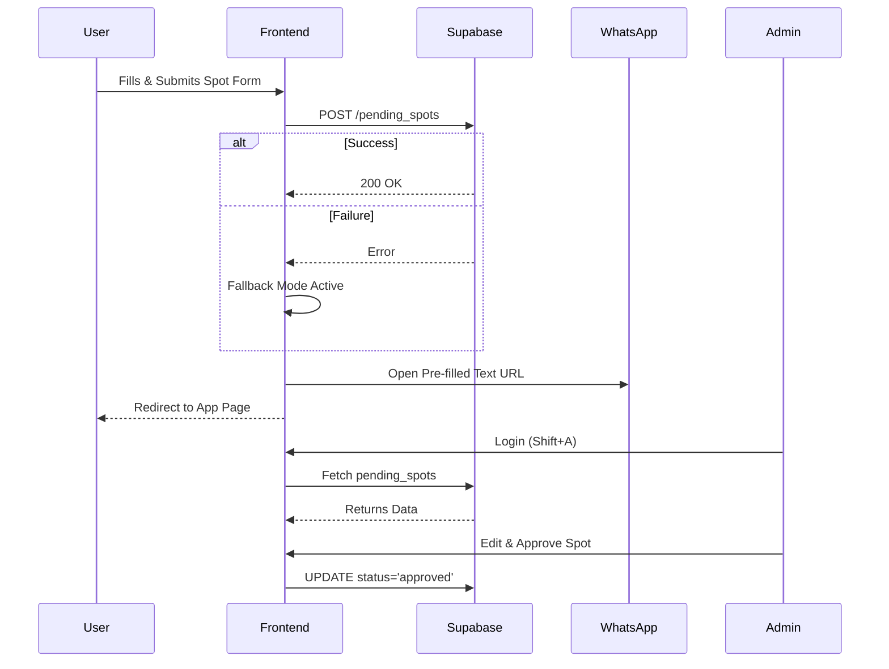

# Sehri Finder - User Flow Documentation

## 1. High-Level Overview
**Product Purpose:** Sehri Finder is a specialized web application designed to help users locate, filter, and share venues offering Sehri (pre-dawn meal during Ramadan). It acts as a community-driven directory that highlights both free (Sadaqah) and paid food options across major cities.

**Target Users:**
1. **Consumers (Seekers):** Individuals looking for reliable Sehri spots near them with specific preferences (e.g., free/paid, family-friendly, masjid vs. restaurant).
2. **Contributors (Community Members):** Users who know of local Sehri spots and want to share them with the community.
3. **Administrators (Curators):** The product team or volunteers responsible for verifying and approving user-submitted spots to maintain data quality.

---

## 2. User Personas & Goals
The system is designed to serve several distinct subgroups, categorized by their specific needs and the tags used for indexing:

- **Persona 1: The Devout Student / Hostel Resident**
  - *Goal:* Find free, local masjid-based Sehri spots near their accommodation.
  - *Context:* Often non-natives living in PGs or hostels without cooking facilities.
  - *Needs:* Filtering by "Free (Sadaqah)" and venue types like "Masjid".
- **Persona 2: The Hospital Caretaker / Patient**
  - *Goal:* Locate spots that deliver to or are within walking distance of major hospitals.
  - *Context:* Stations at hospitals (e.g., Jayadeva, Omandur) unable to leave their wards for long.
  - *Needs:* Identification of "HospitalSupport" spots and dedicated NGO distributions.
- **Persona 3: The Working Professional / Expat**
  - *Goal:* Find reliable, high-quality restaurant Sehri or subscription plans.
  - *Needs:* Filtering by "Restaurant" or "Paid", viewing menus and contact details for booking.
- **Persona 4: The Local Volunteer (Contributor)**
  - *Goal:* Amplify a neighborhood association's free meal distribution.
  - *Needs:* Quick, mobile-friendly submission process to get data into the public directory.
- **Persona 5: The System Admin (Curator)**
  - *Goal:* Moderate submissions to ensure high data fidelity and prevent local misinformation.
  - *Needs:* Verification tools, edit-on-the-fly capabilities, and secure dashboard access.

---

## 3. Entry Points into the System
1. **Landing Page (`/`):** The primary marketing entry point. Introduces the value proposition and prompts city selection.
2. **Deep Links to Cities (`/find/:city`):** Users sharing links to specific city directories (e.g., `/find/chennai`).
3. **Direct App Access (`/find`):** Returning users navigating directly to the main application interface.
4. **Direct Submission Link (`/submit`):** Shared via social media to encourage community contributions.
5. **Admin Portal (`/admin`):** Accessed directly via URL or via an easter egg keyboard shortcut (`Shift + A`).

---

## 4. Detailed Step-by-Step Flows

### Flow A: The Consumer Flow (Finding a Spot)
**Description:** A user searches for, filters, and saves a spot for Sehri.

1. **User Action:** Explores the Landing Page and clicks "Enter App" or selects a city.
   - *System Response:* Routes user to `/find/:city`. The app fetches raw data from Supabase, passes it through the `transformRawSpot` transformer (handling schema normalization and formatting), and loads it into Context.
2. **User Action:** Toggles to Map View or stays in List View.
   - *System Response:* 
     - If Map View: Renders `MapView` with instances of `MarkerClusterGroup` to group dense map points together for better performance.
     - If List View: Renders a grid of `ListingCard` components.
3. **User Action:** Opens Filter Bar and selects "Free (Sadaqah)" and a specific area, OR clicks "Near Me".
   - *System Response:* 
     - Standard Filters: Instantly applies filters to the internal spot array via `useSpotFilter`.
     - Near Me: Requests HTML5 Geolocation. If granted, calculates distances to all spots using the Haversine formula, appends distance string, sorts the dataset by proximity, and re-renders the list/map.
4. **User Action:** Clicks the "Save" (Heart) icon on a specific card.
   - *System Response:* Adds the spot ID to `savedSpotIds` in LocalStorage, updates tab counter.
   - *Data Change:* LocalStorage `sehri_saved_spots` updated.
5. **User Action:** Clicks "Get Directions".
   - *System Response:* Opens a new tab to Google Maps with the venue's coordinates/link.

### Flow B: The Contributor Flow (Submitting a Spot)
**Description:** A user submits a new venue for approval.

1. **User Action:** Clicks "Submit a Spot" from Header or Bottom Nav.
   - *System Response:* Routes to `/submit` and displays the `SubmitSpot` form.
2. **User Action:** Fills out mandatory fields (Name, City, Area, Venue Type, Food Type, Timing).
   - *System Response:* Validates input on the client side.
3. **User Action:** Clicks "Submit Spot".
   - *System Response:* 
     1. Inserts a new record into the `pending_spots` Supabase table with status `pending`.
     2. Generates a pre-filled WhatsApp message.
     3. Redirects the user's browser to WhatsApp Web/App.
   - *Data Change:* New row in `pending_spots`.
   - *Postcondition:* Form resets, user returns to previous page.

### Flow C: The Administrator Flow (Review & Approve)
**Description:** An admin logs in and approves a submitted spot.

1. **User Action:** Presses `Shift + A` on any page or navigates to `/admin`.
   - *System Response:* Shows `AdminLoginPage`.
2. **User Action:** Enters secure password.
   - *System Response:* Validates credentials, sets auth state, routes to `/admin/dashboard`.
3. **User Action:** Views list of `pending_spots`. Clicks on a submission to review.
   - *System Response:* Opens approval modal with editable fields.
4. **User Action:** Modifies formatting if needed, then clicks "Approve".
   - *System Response:* 
     1. Updates Supabase record status to `approved`.
     2. (Optionally) moves data to the main public spots table or updates a unified view.
   - *Data Change:* Status change in database. Spot becomes visible to consumers.

---

## 5. Happy Path Scenarios
- **Seeking Food:** User lands on `/` -> Selects 'Chennai' -> Sees 10 spots -> Filters by 'Masjid' -> Finds 3 spots -> Gets directions to the closest one.
- **Contributing:** User is at their local masjid -> Opens `/submit` on their phone -> Fills out details -> Clicks Submit -> Confirmation sent via WhatsApp -> Admin approves 1 hour later.

---

## 6. Alternate Flows & Edge Cases
- **Empty State (No Results):** If a user applies filters that yield 0 results, the `EmptyState` component is shown with a prompt to "Clear Filters" or "Submit a Spot".
- **Network Failure on Submit:** If the Supabase insert fails, the `catch` block ensures the WhatsApp fallback still triggers, ensuring no data loss for the business process.
- **Unsupported City URL:** If a user visits `/find/newyork`, the app detects it's unsupported and either defaults to the primary city or shows a graceful empty state.
- **Location Permission Denied:** If the user clicks "Near Me" but denies browser location access, a toast notification politely informs them to enable permissions.

---

## 7. Decision Points & Branching Logic
- **Routing Branch:** Does the user have `sessionStorage('hasShownSplash')`? 
  - Yes -> Render `Routes` immediately.
  - No -> Render `SplashScreen` -> on complete -> set storage -> Render `Routes`.
- **View Toggle Branch:** List View vs. Map View. Both rely on the same `filteredData` array but render completely different DOM structures.

---

## 8. Dependencies on External Services
1. **Supabase:** Used as the backend database (PostgreSQL) for storing app data and pending submissions.
2. **Vercel Analytics & Speed Insights:** Integrated for tracking usage metrics and performance.
3. **WhatsApp API:** Used as a notification/fallback mechanism for spot submissions.
4. **Google Maps / URL Intents:** Relied upon for external navigation handoffs.

---

## 9. Security & Authorization Considerations
- **Admin Access:** Currently protected by an application-level login (likely a shared password or simple JWT check). This should ideally move to Supabase Auth (RLS policies) for robust security.
- **Rate Limiting:** Submission forms and admin login endpoints are vulnerable to brute force/spam. Vercel KV rate limiting or Cloudflare protections should be considered.
- **Data Sanitization:** All user inputs in the submission form must be sanitized before rendering on the admin dashboard to prevent XSS.

---

## 10. Performance Considerations
- **Map View Weight:** Map libraries (like Leaflet/Mapbox) are heavy. Dynamic importing/lazy loading is recommended to keep the initial TTI (Time to Interactive) low on mobile devices.
- **Splash Screen Overhead:** The splash screen masks underlying data fetching.
- **Listing Images:** If listing cards include images in the future, they must be rigorously optimized (WebP, Next/Vercel image optimization) to prevent layout shifts and slow loads on 3G networks.

---

## 11. Opportunities for Improvement
- **User Accounts (Optional):** Allowing consumers to create accounts to sync saved spots across devices.
- **Gamification for Contributors:** Rewarding volunteers who submit accurate spots with a "Trusted Contributor" badge.
- **Real-time Status Updates:** A system for users to report "Food Ran Out" or "Crowded" to update the listing in real-time for others.
- **Admin Automation:** Auto-rejecting obvious spam using edge functions or basic AI validation before it hits the admin queue.

---

## 12. Diagrams (Mermaid)

### Primary Consumer Navigation Flow

### Submission & Admin Flow

